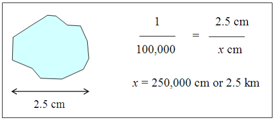
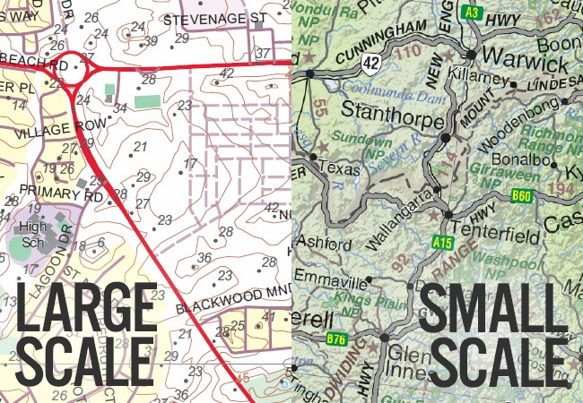
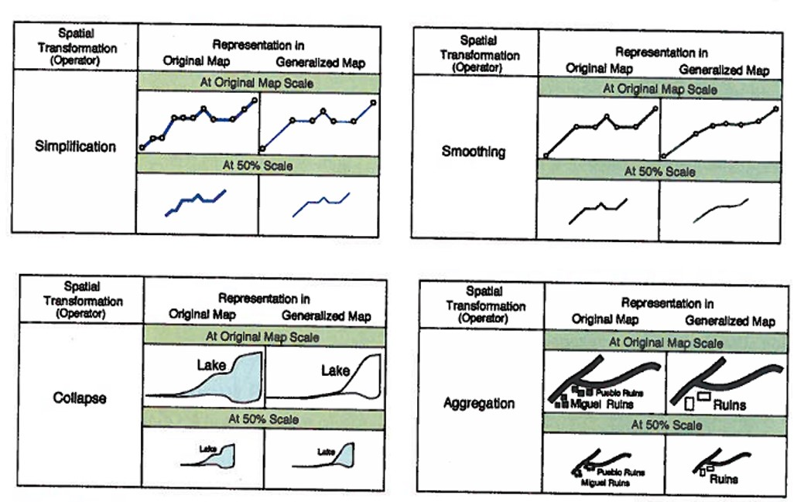
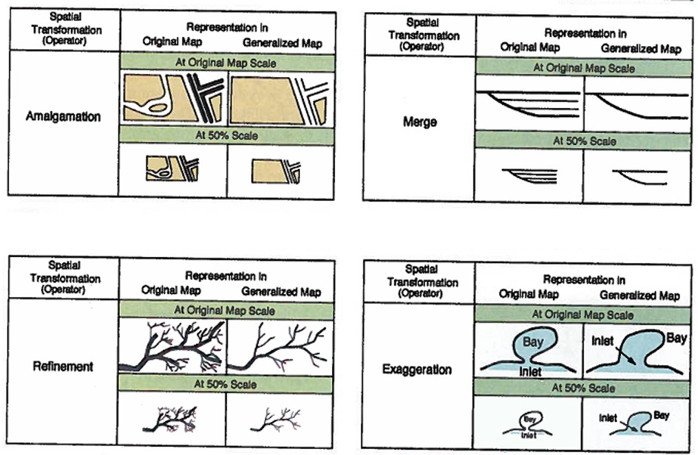
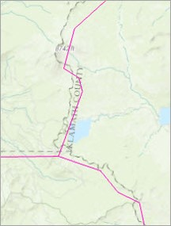
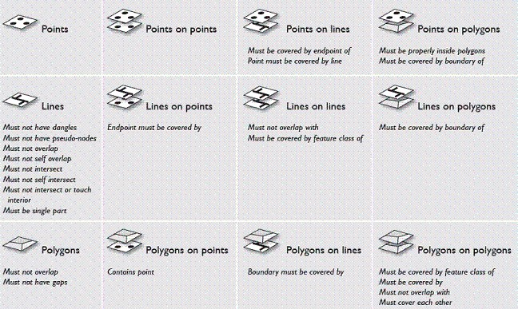
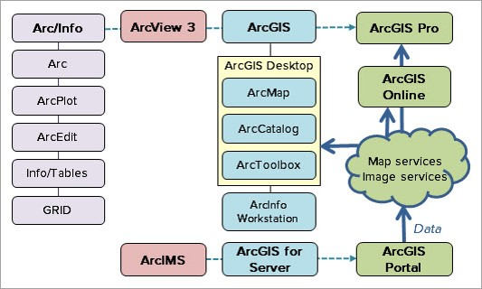
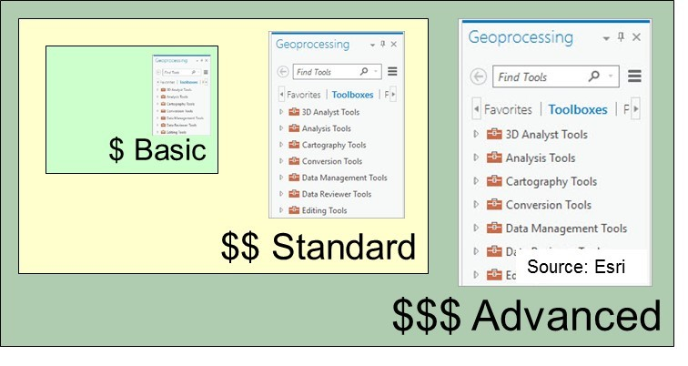

@title[GIS Data Basics]
GIS Data Basics
-------------------------------
### @fa[globe fa-5x]
###### D.J. Biddle, GISP
###### Use the @fa[angle-down] and @fa[angle-right] arrows to navigate
---
@title[the plan]
#### the plan
- The way I see it...conceptual models @fa[arrow-right] data models
- Issues of representation
- The evolution of the ArcGIS platform
---
@title[Conceptual Models vs Data Models]

@snap[west span-40]
@css[fragment](First, a question...)
@snapend

@snap[east span-50]
@css[fragment](What *ARE* GIS data?)
@snapend
+++
@snap[north span-20]
@css[fragment](A layer??)
@snapend

@snap[west span-40]
@css[fragment](A shapefile?)
@snapend

@snap[east span-60]
@css[fragment](An image?)
@snapend

@snap[south span-80]
@css[fragment](A GPS file?)
@snapend
+++
While all are terms for GIS data of some type, none really gets at the essence of what GIS data really are?
+++
In the simplest terms, GIS data are representations of reality. 

+++
GIS data are...

- **Models** for understanding the real world.
- **Structures** to facilitate knowledge
- **Links** between
    - Place/Location
	- Time (whether explicit or not)
	- Attributes/Descriptions
+++
Could these terms not be used to describe...

- Oral/written accounts?
- Paper maps? 
- Mental maps? 

What makes GIS data unique? 
+++
**Digital spatial representations**

Before we get to @fa[arrow-up], we have to answer...

- What to represent?
- How we represent it? 
    - What **conceptual model** do we adopt? 
+++
##### Conceptual models

How are geographic features distributed in the real world?

In GIS, we rely on two primary models...

@snap[south-west span-40]
@box[bg-blue text-white rounded box-padding fragment](Discrete Objects)
@snapend

@snap[south-east span-40]
@box[bg-green text-white rounded box-padding fragment](Continuous Fields)
@snapend
+++
##### Discrete Objects

Objects exist is a defined/bounded location

- Single features @fa[angle-right] points
- Connected sets of points @fa[angle-right] lines
- Lines that enclose areas @fa[angle-right] polygons
+++
@snap[north-west span-80]
 
@css[text-black fragment](Tree: Point Feature)
@snapend

@snap[east]
@css[text-black fragment](Road: Line Feature) 

@snapend

@snap[south-west]
 
@css[text-black fragment](Building: Polygon Feature)
+++
#### But what about a mountain? 

+++
##### Continuous Fields

Each feature/quantity is measurable *everywhere*

- Elevation
- Population *density*
- Precipitation amount
- Percent canopy closure
+++
From Conceptual model @fa[arrow-right] Data model...

Discrete objects become...@css[fragment](*vector data*)

Continuous fields become...@css[fragment](*raster data*)
+++
@snap[west span-50]

@snapend

@snap[east span-50]
@box[bg-gray text-white waved box-padding](Vector Model# **Features** are stored map objects. **Feature classes** are collections of similar objects that share the geometry and attributes.)
+++
@snap[west span-50]

@snapend

@snap[east span-50]
@box[bg-gray text-white waved box-padding](Attibute Tables# Features are linked to tables containing information about the spatial objects.   The map object and the table data are connected by a unique integer.)
@snapend
+++
@snap[west span-50]

@snapend

@snap[east span-50]
@box[bg-gray text-white waved box-padding](Raster Data# The raster model breaks map areas into small squares known as cells or pixels.   A single numeric value is stored in each cell, such as elevation.)
@snapend
+++
##### Vector vs Raster

---
##### Issues of representation

The real world is **infinitely complex**...

BUT, we our ability to *sample* and *store* data is **limited**. 

@css[fragment](So, what gets represented, and what gets left out?)
+++
@snap[north]
@css[text-black](Often, the **scale** of our data dictates the level of detail we can achieve)
@snapend
@snap[south]
@box[bg-gray text-white waved box-padding](Map Scale# Map scale is the ratio of distance on the map to distance on the ground.    It is dimensionless and can be expressed in any units: cm or inches or mm.)
+++
1 cm on map = 100,000 cm on ground

+++
**Large** scale maps have features that appear *larger* than they would in **small** scale maps.

+++
##### Scale Impacts
- Generalization: Simplifying features for map display
    - Loss of detail/omission of features at **smaller** scales
    - The *Baltimore Phenomenon*

- Aggregation and MAUP
    - At what scale do features merge to become one? 
	- Where do we draw the boundaries of aggregate units?
+++

+++

+++
Two representations of the same feature, at different source scales...

+++
##### Data Quality
- No data are perfect...always a compromise
- **Quality is defined as the fitness of the data for the intended use**
    - Data that works for one problem may be unsuitable for another.
- As an GIS user, it is *your* responsibilty to determine the suitability of your data to its intended use. 
+++
##### Data Accuracy
Multiple dimensions to accuracy...

- Geometric accuracy
- Thematic accuracy
- Logical consistency
+++
##### Geometric accuracy

Is the feature where it says it is?	

- Errors from source data (GPS, image data, digitzing) can propegate during processing
- *Data validation* compares one dataset to a high accuracy reference to determine accuracy.
+++
##### Thematic accuracy

How accurate are the attributes? 

- How was it measured? 
- What was the accuracy of the measurement? 
- What sources of error were present? 
+++
##### Logical consistency

How well does the data represent the real world? 

- **Topology** @fa[arrow-right] rules that spatial data must adhere to.
- Roads must connect to ones another
- County boundaries cannot have gaps or overlaps
- City points must be contained within county polygons. 
+++

+++
##### Precision

**Precision** can mean one of two things in science...

@ul
- How many significant digits/decimal places in a measurement?
    - The GPS device is precise to 1-meter.
- The statistical variability of a repeated measurement.
    - 20 GPS readings of a location  have a std. dev. of 5 meters. The *precision* is ~10 meters.
@ulend
+++
##### Accuracy vs. Precision

+++
##### Data Citations
**Citing data is a professional and ethical responsibility**

A good citation enables someone to find the source should they wish to obtain a copy

Formats may vary for different agencies or companies
+++
##### Citation Format

**Data set name (Year published) [source type]. Producer name, producer contact information. Resource URL: [Date accessed].**
+++
##### Citation Examples

- Black Hills RIS Vegetation Database (2008) [downloaded file]. Black Hills National Forest, Custer, SD. URL: http://www.fs.usda.gov/main/blackhills/landmanagement/gis [August, 2010].
- Esri™ Data and Maps (2012) [DVD]. Esri™, Inc., Redlands, CA.
- National Hydrography Dataset (2015) [downloaded file]. United States Geological Survey on the National Map Viewer. URL: http://viewer.nationalmap.gov/viewer/ [July 23, 2015].
- USA Topo Maps (2009) [map service]. Esri™ on ArcGIS Online. URL: http://server.arcgisonline. com/ arcgis/services/USA_Topo_Maps/MapServer [January 1, 2012].
---
### The Evolution of ArcGIS 

From ArcInfo @fa[arrow-right] ArcGIS Pro
+++

+++
##### Software Tiers

+++
##### Evolution of GIS
@snap[north](As processing power, connection speeds, storage capacity, graphics capabilities increase, GIS software has evolved to leverage new paradigms.)
@snapend

@snap[south-west span-40]
@box[bg-blue text-white waved box-padding](Expensive memory Less disk storage Slow networks Mainframe or desktop Extensive training Data silos)
@snapend

@snap[south span-20]
@fa[arrow-right]
@snapend

@snap[south-east span-40]
@box[bg-green text-white waved box-padding](Cheap memory More disk storage Fast networks Desktop or mobile Less training Data services)
+++

 

	

