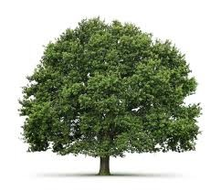
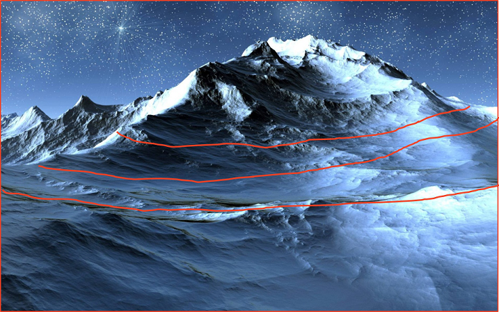
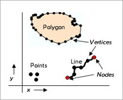
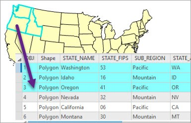
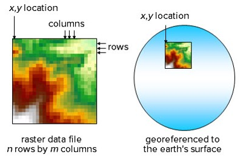
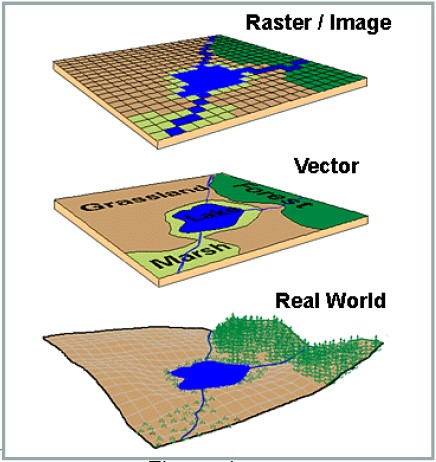

@title[GIS Data Basics]
GIS Data Basics
-------------------------------
### @fa[globe fa-5x]
###### D.J. Biddle, GISP
###### Use the @fa[angle-down] and @fa[angle-right] arrows to navigate
---
@title[the plan]
#### the plan
- The way I see it...conceptual models @fa[arrow-right] data models
- Issues of representation
- An evolution of the ArcGIS platform
---
@title[Conceptual Models vs Data Models]

@snap[west span-40]
@css[fragment](First, a question...)
@snapend

@snap[east span-50]
@css[fragment](What *ARE* GIS data?)
@snapend
+++
@snap[north span-20]
@css[fragment](A layer??)
@snapend

@snap[west span-40]
@css[fragment](A shapefile?)
@snapend

@snap[east span-60]
@css[fragment](An image?)
@snapend

@snap[south span-80]
@css[fragment](A GPS file?)
@snapend
+++
While all are terms for GIS data of some type, none really gets at the essence of what GIS data really are?
+++
In the simplest terms, GIS data are representations of reality. 

+++
GIS data are...

- **Models** for understanding the real world.
- **Structures** to facilitate knowledge
- **Links** between
    - Place/Location
	- Time (whether explicit or not)
	- Attributes/Descriptions
+++
Could these terms not be used to describe...

- Oral/written accounts?
- Paper maps? 
- Mental maps? 

What makes GIS data unique? 
+++
**Digital spatial representations**

Before we get to @fa[arrow-up], we have to answer...

- What to represent?
- How we represent it? 
    - What **conceptual model** do we adopt? 
+++
##### Conceptual models

How are geographic features distributed in the real world?

In GIS, we rely on two primary models...

@snap[south-west span-40]
@box[bg-blue text-white rounded box-padding fragment](Discrete Objects)
@snapend

@snap[south-east span-40]
@box[bg-green text-white rounded box-padding fragment](Continuous Fields)
@snapend
+++
##### Discrete Objects

Objects exist is a defined/bounded location

- Single features @fa[angle-right] points
- Connected sets of points @fa[angle-right] lines
- Lines that enclose areas @fa[angle-right] polygons
+++
@snap[north-west span-80]
 
@css[text-black fragment](Tree: Point Feature)
@snapend

@snap[east]
@css[text-black fragment](Road: Line Feature) 

@snapend

@snap[south-west]
 
@css[text-black fragment](Building: Polygon Feature)
+++
#### But what about a mountain? 

+++
##### Continuous Fields

Each feature/quantity is measurable *everywhere*

- Elevation
- Population *density*
- Precipitation amount
- Percent canopy closure
+++
From Conceptual model @fa[arrow-right] Data model...

Discrete objects become...@css[fragment](*vector data*)

Continuous fields become...@css[fragment](*raster data*)
+++
@snap[west span-50]

@snapend

@snap[east span-50]
@box[bg-gray text-white waved box-padding](Vector Model# **Features** are stored map objects. **Feature classes** are collections of similar objects that share the geometry and attributes.)
+++
@snap[west span-50]

@snapend

@snap[east span-50]
@box[bg-gray text-white waved box-padding](Attibute Tables# Features are linked to tables containing information about the spatial objects.   The map object and the table data are connected by a unique integer.)
@snapend
+++
@snap[west span-50]

@snapend

@snap[east span-50]
@box[bg-gray text-white waved box-padding](Raster Data# The raster model breaks map areas into small squares known as cells or pixels.   A single numeric value is stored in each cell, such as elevation.)
@snapend
+++
##### Vector vs Raster

---
##### Issues of representation

The real world is *infinitely complex*...

BUT, we our ability to *sample* and *store* data is **limited**. 

@css[fragment](So, what gets represented, and what gets left out?)
+++

